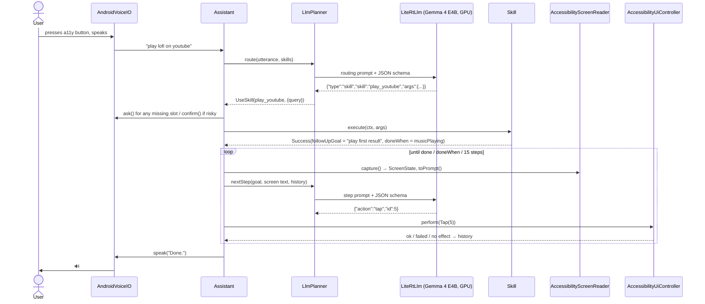
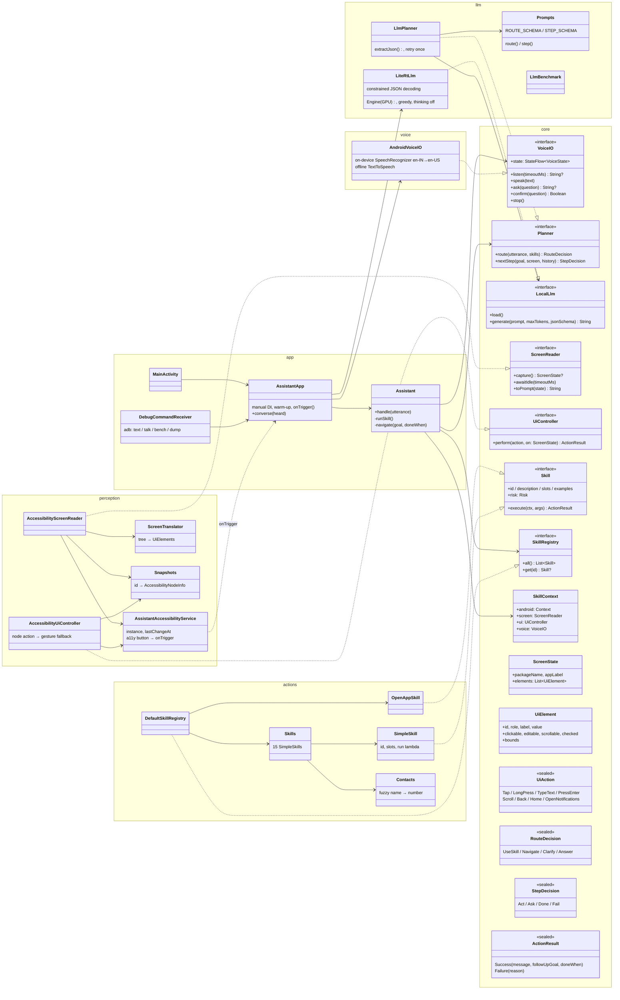

# Architecture

## Approach in one paragraph

A small on-device model is good at *choosing from a short menu* and bad at *driving a raw UI
tree*. So every request goes through two tiers:

1. **Skills first.** The model maps the request to a registered skill plus its slot values
   (`set_alarm(time=06:30)`). Skills are plain Kotlin that fire Android intents or deep links:
   fast, deterministic, no screen reading.
2. **Screen navigation as fallback.** For anything else, the model drives the UI one step at
   a time. It never sees the raw accessibility tree, only a **translated screen**: a numbered
   list of meaningful elements (`[5] button "lofi music"`). It answers with one action.

A skill can also do **both**: deep-link to the right screen, then hand a short follow-up goal
("play the first result") to navigation. The user only talks and listens. Missing details are
asked for by voice, and risky actions (call, SMS) need a spoken "yes".

## Request flow

## Class diagram

## Module rules

- `:core` holds only interfaces and data classes. Every other module depends on `:core`, never on
  each other. `:app` is the only module that knows all of them (manual DI in `AssistantApp`).
- Swapping a part means one new class. For example, a Qualcomm NPU runtime is another
  `LocalLlm`, and Whisper speech input is another `VoiceIO`. Nothing else changes.

## The translation layer (`ScreenTranslator`)

Raw accessibility trees are hundreds of nested nodes, mostly layout wrappers. The translator:

| Step | Why |
|---|---|
| Read the **active window** plus dialogs above it; skip the status/nav bar, OEM bubbles and the keyboard | The model should only see the app the user is in |
| Drop invisible, zero-size and off-screen nodes | Noise |
| **One element per actionable node** (click/edit/check/scroll) | These are the things you can *do* |
| Label = own text → content description → hint → **children's text joined** → readable resource id | A list row becomes `"Mom, Call me when free, 10:42"` |
| Drop layout-ish resource ids (`vcommonlayout_toptargetview`) | They tell the model nothing |
| Clean labels: strip stray commas, de-duplicate repeated segments, cap at 60 chars | Shorter prompt, faster model |
| Sort in reading order, number 1..N, cap at 80 | Stable ids for the model to answer with |
| Keep id → node map (`Snapshots`) | The controller acts on the node the model picked |

A typical YouTube screen comes out as ~13 lines and ~500 characters.

## Making the small model reliable

- **Constrained decoding:** LiteRT-LM's `ResponseFormat.json(schema)`, so output is always our
  JSON shape (plus a tolerant parser for the decoder's stray `{"` prefix).
- **Greedy sampling, thinking off.** Deterministic and fast.
- **Slot descriptions do the normalising:** `time: 24-hour HH:MM` makes the model turn
  "6 30 in the morning" into `06:30`, so Kotlin never parses free text.
- **Labeled history:** `tap "lofi music" -> NO EFFECT, screen unchanged` tells the model to try
  something else. The same action three times ends the run instead of looping.
- **Tap fallback:** if an accessibility click doesn't change the UI within 600 ms, send a real
  touch gesture. YouTube's suggestions need this.
- **`doneWhen`:** skills can end navigation from device state (music started playing) that the
  model can't see on screen.
